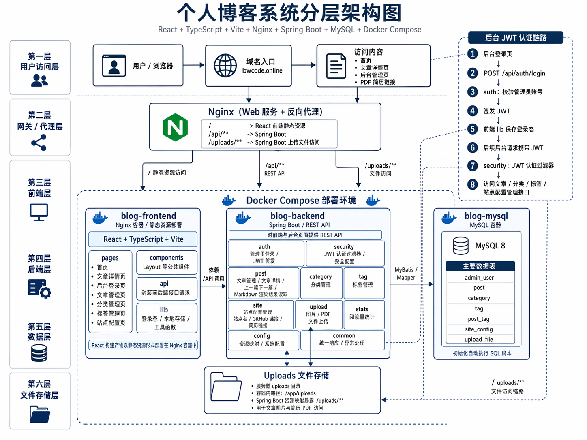
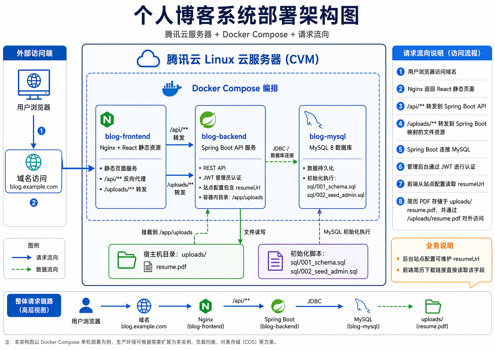
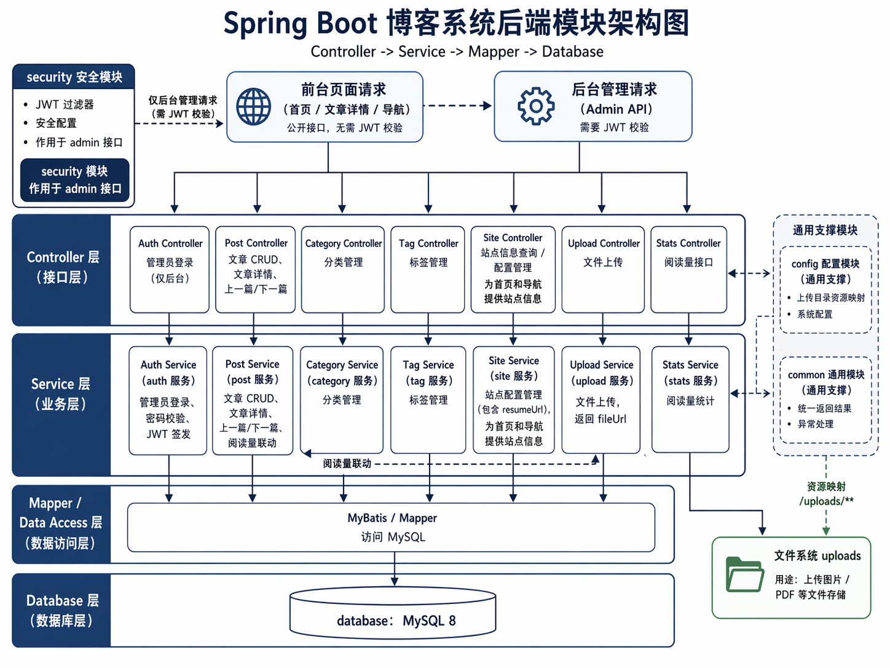

# 个人博客系统

一个基于 `React + Spring Boot + MySQL` 实现的个人博客系统，包含前台展示页面和单管理员后台，适合作为个人作品集、技术笔记平台或全栈练手项目。

## 项目特性

### 前台

- 首页展示站点信息与文章列表
- 标题搜索
- 分类筛选
- 标签筛选
- 文章详情页
- Markdown 渲染
- 文章目录导航
- 上一篇 / 下一篇跳转
- 阅读量展示

### 后台

- 管理员登录
- 文章新增、编辑、删除
- 文章发布 / 下线
- 分类管理
- 标签管理
- 站点配置管理
- 图片上传并插入 Markdown

### 工程能力

- 前后端分离
- 基础单元测试与集成测试
- Docker / Docker Compose 部署支持
- Nginx 反向代理配置

## 技术栈

### 前端

- React 19
- TypeScript
- Vite
- React Router
- Tailwind CSS
- Vitest + Testing Library

### 后端

- Spring Boot 3
- Spring Security
- JWT
- MyBatis-Plus / MyBatis 注解 Mapper
- MySQL 8
- JUnit 5 + Mockito + Jacoco

### 部署

- Docker
- Docker Compose
- Nginx

## 项目结构

```text
blog/
├─ blog-server/                  # Spring Boot 后端
├─ frontend/                     # React 前端
├─ sql/                          # 数据库初始化脚本
├─ docker/                       # Docker Compose 与 Nginx 配置
├─ docs/                         # 设计文档、计划、测试与评审报告
├─ .env.example                  # 环境变量示例
└─ README.md
```

## 架构图

### 1. 部署架构图

展示系统部署在腾讯云 Linux 服务器上的整体拓扑，包括 Docker Compose 编排、Nginx 转发、Spring Boot API、MySQL 数据库以及 uploads 文件目录。



### 2. 分层架构图

展示系统从用户访问层、网关代理层、前端层、后端层、数据层到文件存储层的完整分层结构，以及后台 JWT 认证链路。



### 3. 后端模块架构图

展示 Spring Boot 后端的模块划分与调用关系，重点说明 Controller、Service、Mapper、Database 的分层结构，以及 security、config、common、upload 等模块职责。



## 本地开发

### 环境要求

- JDK 21+
- Maven 3.9+
- Node.js 20+
- npm 10+
- MySQL 8

### 1. 初始化数据库

依次执行：

- `sql/001_schema.sql`
- `sql/002_seed_admin.sql`

### 2. 配置后端环境变量

后端读取以下环境变量：

- `SPRING_DATASOURCE_URL`
- `SPRING_DATASOURCE_USERNAME`
- `SPRING_DATASOURCE_PASSWORD`
- `BLOG_JWT_SECRET`

示例：

```text
SPRING_DATASOURCE_URL=jdbc:mysql://localhost:3306/blog?useSSL=false&allowPublicKeyRetrieval=true&serverTimezone=Asia/Shanghai&characterEncoding=utf8
SPRING_DATASOURCE_USERNAME=root
SPRING_DATASOURCE_PASSWORD=your_local_mysql_password
BLOG_JWT_SECRET=your_long_random_secret
```

### 3. 启动后端

```bash
cd blog-server
mvn spring-boot:run
```

默认地址：

```text
http://localhost:8080
```

### 4. 启动前端

```bash
cd frontend
npm install
npm run dev
```

默认地址：

```text
http://localhost:3000
```

当前开发环境下，Vite 会将 `/api` 请求代理到：

```text
http://localhost:8080
```

## 后台入口

```text
http://localhost:3000/admin/login
```

主要后台页面：

- `/admin/login`
- `/admin/posts`
- `/admin/posts/new`
- `/admin/posts/:id/edit`
- `/admin/categories`
- `/admin/tags`
- `/admin/site-config`

## 测试命令

### 后端

```bash
mvn -f blog-server/pom.xml test
```

### 前端

```bash
cd frontend
npm test
npm run lint
npm run build
npm run test:coverage
```

## Docker 部署

### 环境变量

复制 `.env.example` 为 `.env`，并填入真实值：

```env
MYSQL_ROOT_PASSWORD=change_me
BLOG_JWT_SECRET=change_me_to_a_long_random_secret
SPRING_DATASOURCE_USERNAME=root
SPRING_DATASOURCE_PASSWORD=change_me
SPRING_DATASOURCE_URL=jdbc:mysql://mysql:3306/blog?useSSL=false&allowPublicKeyRetrieval=true&serverTimezone=Asia/Shanghai&characterEncoding=utf8
```

### 校验配置

```bash
docker compose --env-file .env.example -f docker/docker-compose.yml config
```

### 启动容器

```bash
docker compose --env-file .env -f docker/docker-compose.yml up -d --build
```

主要容器：

- `blog-mysql`
- `blog-backend`
- `blog-frontend`

## 版本控制建议

不应提交到仓库的内容：

- `.env`
- 本地数据库密码
- 本地 JWT 密钥
- IDE 本地配置
- `node_modules`
- `dist`
- `target`
- `coverage`

当前 `.gitignore` 已忽略常见本地文件和构建产物。

## 后续可扩展方向

- 首页标签改为读取全部标签，而不是从文章中聚合
- 增强 Markdown 编辑体验
- 增加项目展示页或简历展示模块
- 接入 HTTPS 与云服务器部署文档
- 优化移动端排版与详情页阅读体验
